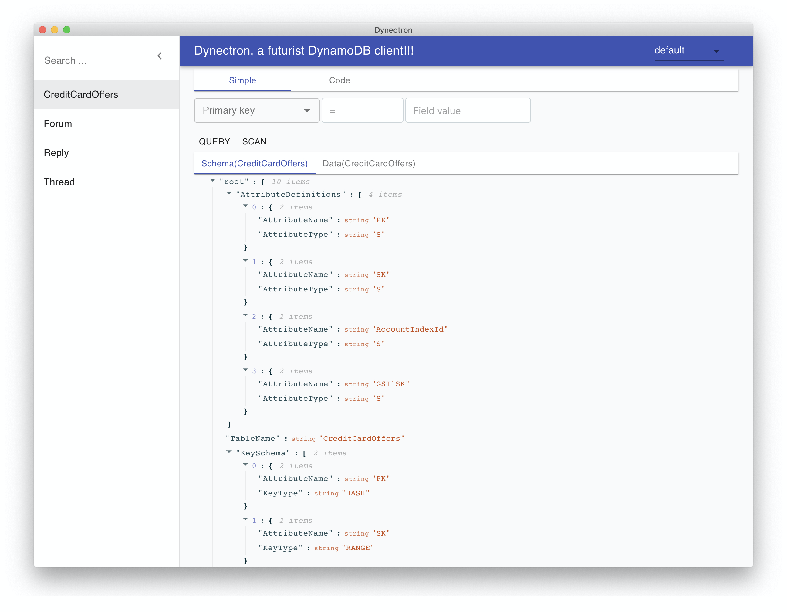
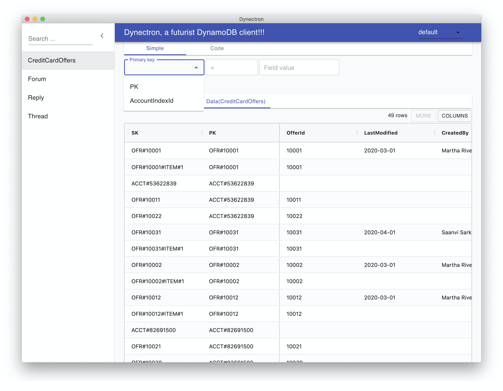
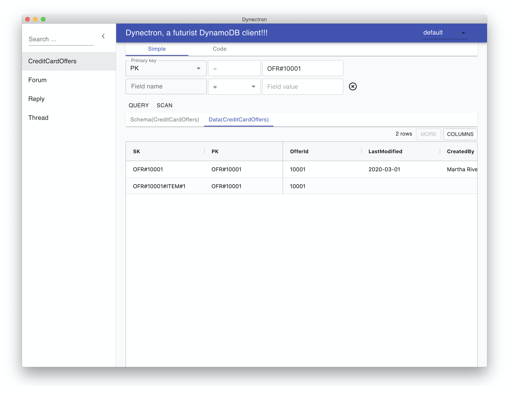
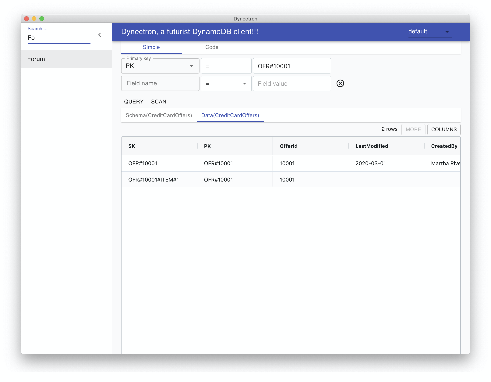
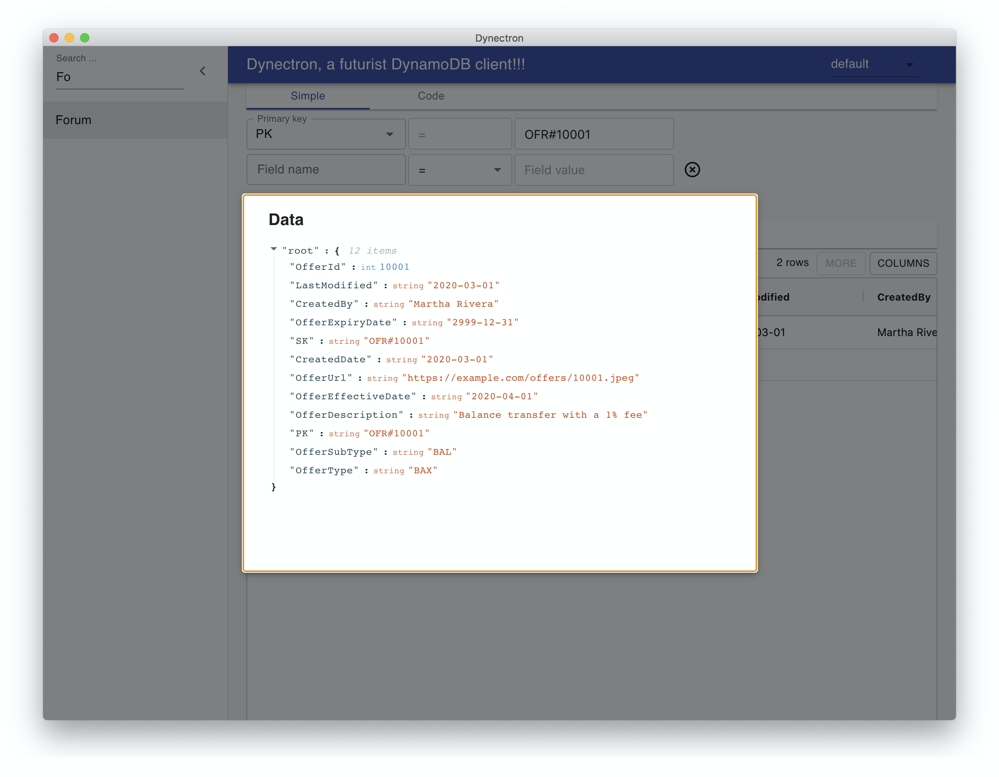
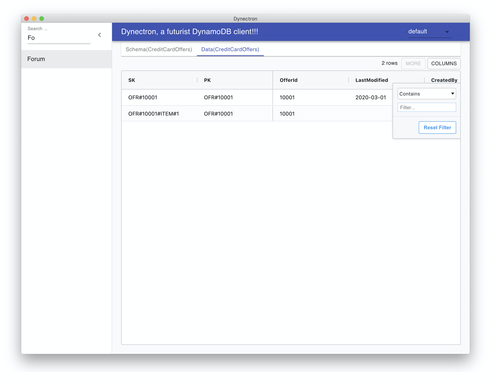
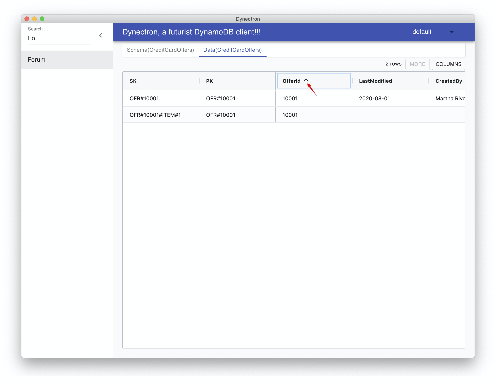
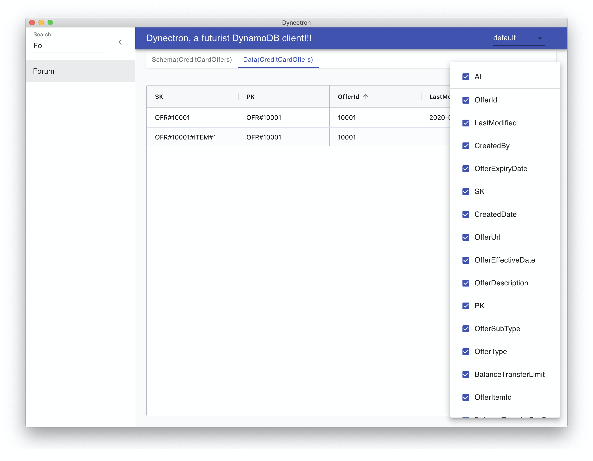
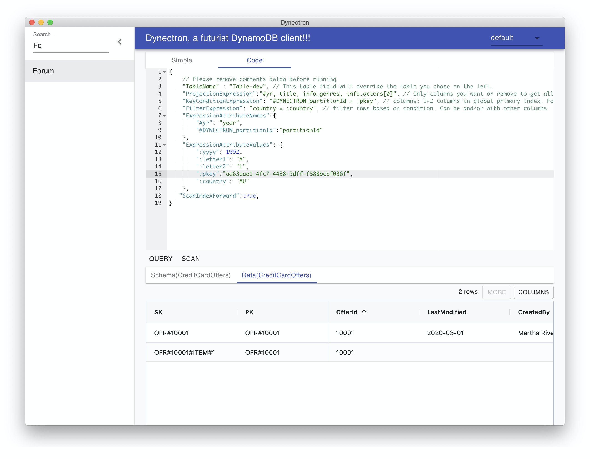

# How to run
To run this software, please make sure that you have node js installed, prefer version > lts 12.x.x. \
Please run the following commands

1. `npm install`

2. `npm run build`

3. `npm run start`

# How to use
If you use any assume role for AWS authentication or using aws-vault, please remember to export environment variables before running `npm run start`. And please choose `environment` option when selecting profile. It will use credentials store in process environment to authenticate and do the job.

Once you see the list of tables on the left, you can click on that table to see the selected table's schema in `SCHEMA` tab.

For querying data, you can click on `Simple` tab to enter conditions or on `Code` to open query editor.

You can either enter the table name in that query or omit it (it will use the selected one as table).

Query editor is a full-fledge editor support by ACE. Please refer to [ACE shortcut keys](https://ace.c9.io/demo/keyboard_shortcuts.html) for more information. Or you can press `F1` for command palette.

Once you're ok with the query, please click on EXECUTE to run the query, the data will be showed in `Data` tab below query.

# How to connect to local dynamodb
Please set `DYNAMODB_ENDPOINT` to your local dynamodb and restart the app, then choose environment to query it against local dynamodb.

# Screenshots
### Select table and click Scan to scan table

### Select table and click Scheme tab to see table's metadata like Key Schema, Second Global Index, Second Local Index...

### Select table, then on Simple tab, choose pre-populated primary keys to begin querying. Primary keys are prepopulated from table's indexes

### After chose primary key, click QUERY to load data from DynamoDB

### You can also filter table's names by search box on the top left

### In order to view whole row data, click on a row

### Click on any column's header menu to start filtering row

### Or click on column to sort

### Click on COLUMNS menu to show/hide any columns in data view

### Using code editor to craft any complex query with pre-populated JSON with instructions

